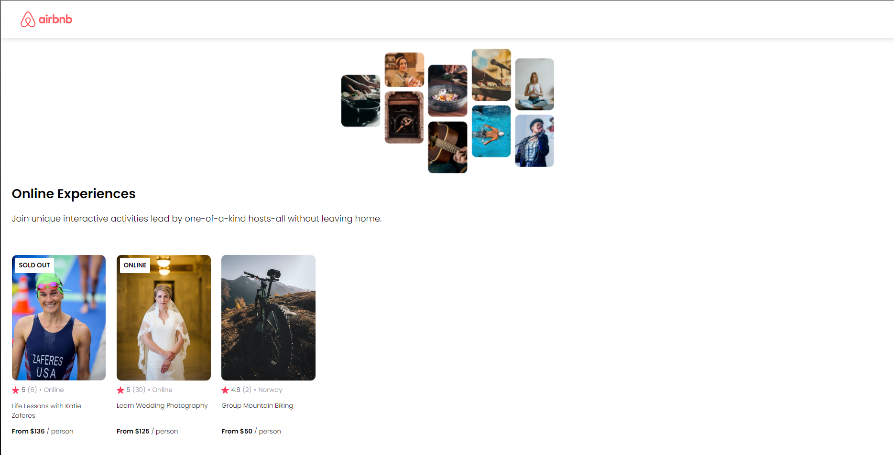

# airbnb-clone

This project is a simplified version of the Airbnb website, developed with React and Vite. It serves as is a beginner guide for learning basic concepts of React, such as *Components*, *Props*, *Conditional Rendering*, and *Rendering Lists*.

## Preview



## Getting Started

To run the Airbnb Clone locally, follow these steps:

- **Clone the Repository**

  ```bash
  git clone https://github.com/LeonardoReisC/react-practice-projects.git
  ```

- **Navigate to the Project Directory**

  ```bash
  cd ./airbnb-clone/
  ```

- **Install Dependencies**

  ```bash
  npm install
  ```

- **Start the Application**

  ```bash
  npm run dev
  ```

***