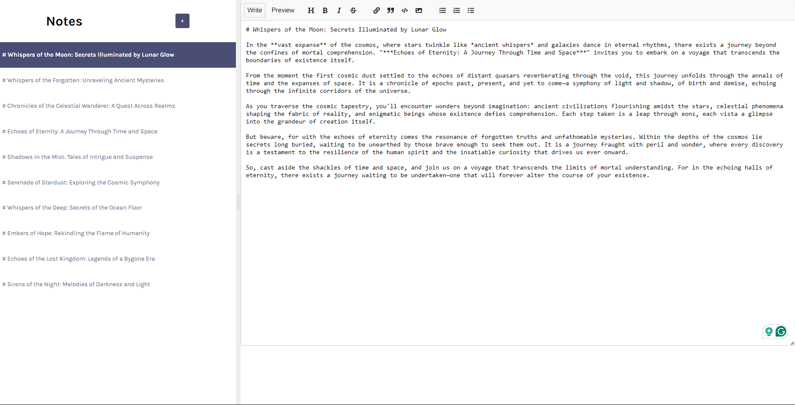

# notes-app

This project is a guide for learning React hooks such as `useState` and `useEffect` while building a notes application that allows users to create, update, and delete text annotations. The app is integrated with Firestore database for data storage.

## Preview



## Getting Started

To run the React Notes App locally, follow these steps:

- **Clone the Repository**

  ```bash
  git clone https://github.com/LeonardoReisC/react-practice-projects.git
  ```

- **Navigate to the Project Directory**

  ```bash
  cd ./notes-app/
  ```

- **Install Dependencies**

  ```bash
  npm install
  ```

- **Set up environment variables with `.env.local`**

  ```bash
  cp .env.local.example .env.local
  ```

- **Start the Application**

  ```bash
  npm run dev
  ```

***
