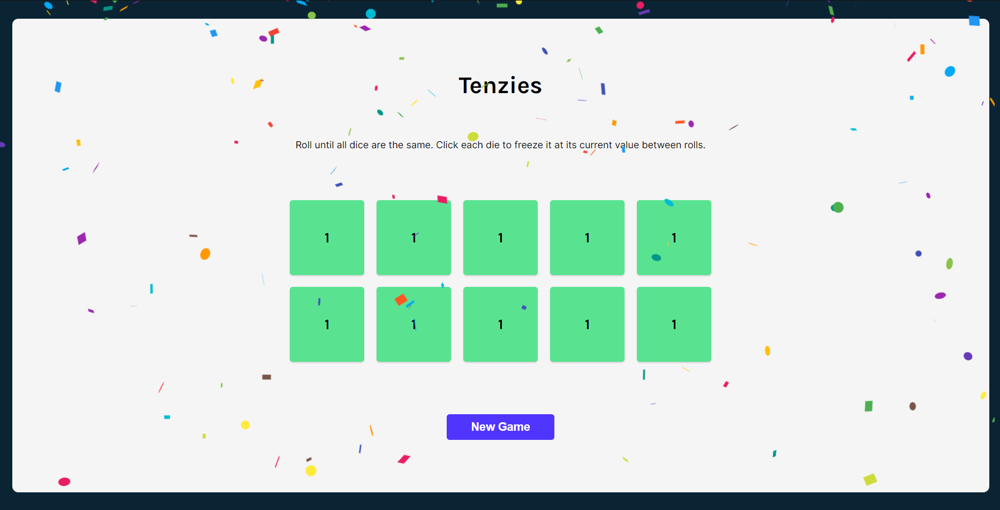

# tenzies-game

This project serves as a recapitulation of all React concepts learned so far. It's a fun and interactive game where players roll dice to match the target number using React components and state management.

## Preview



## Getting Started

To run the Tenzies Game locally, follow these steps:

- **Clone the Repository**

  ```bash
  git clone https://github.com/LeonardoReisC/react-practice-projects.git
  ```

- **Navigate to the Project Directory**

  ```bash
  cd ./tenzies-game/
  ```

- **Install Dependencies**

  ```bash
  npm install
  ```

- **Start the Application**

  ```bash
  npm run dev
  ```

***
